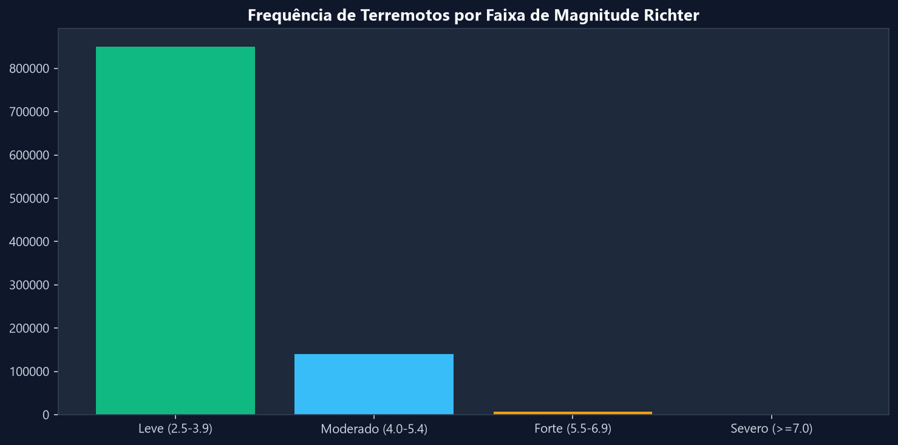
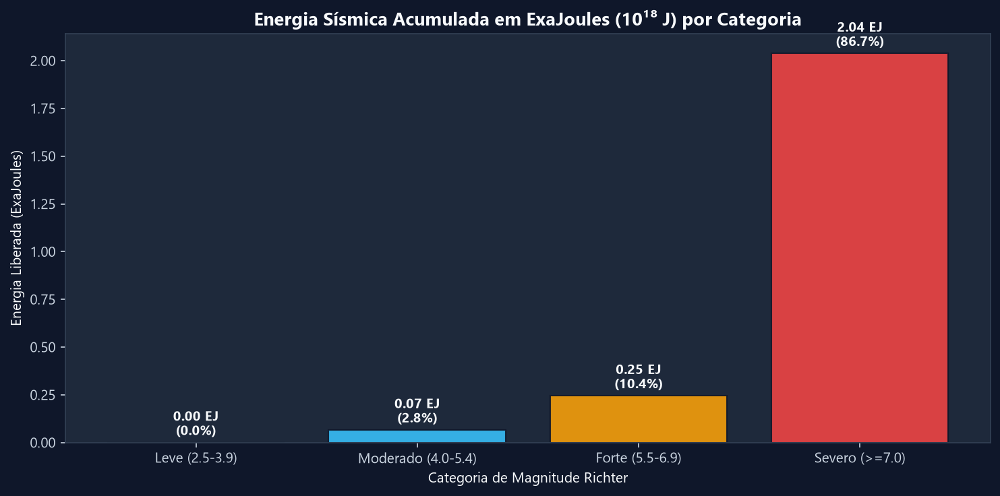
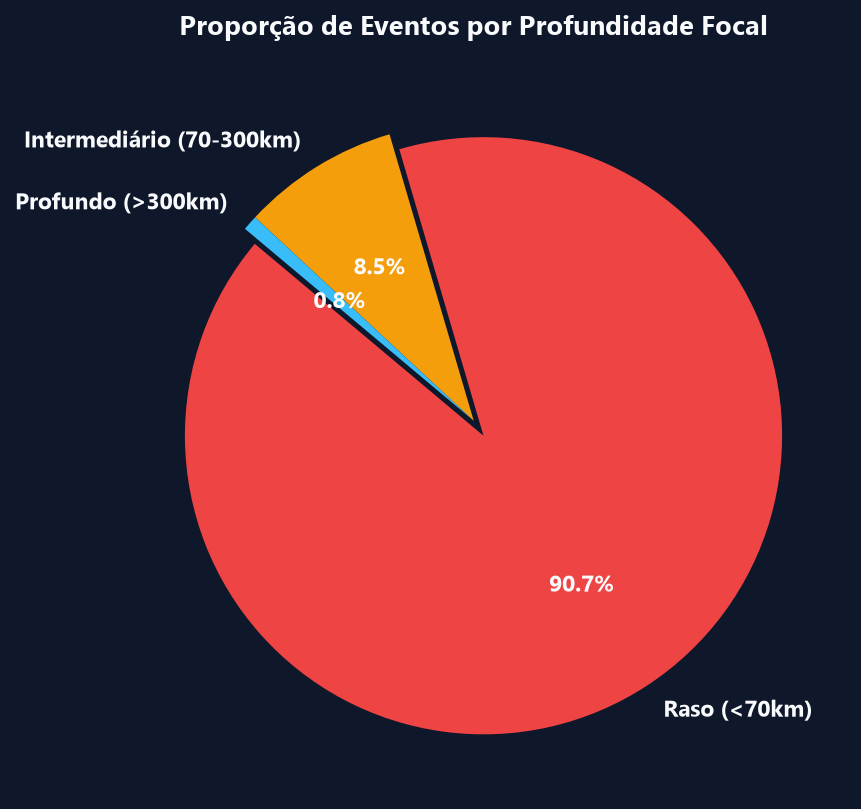
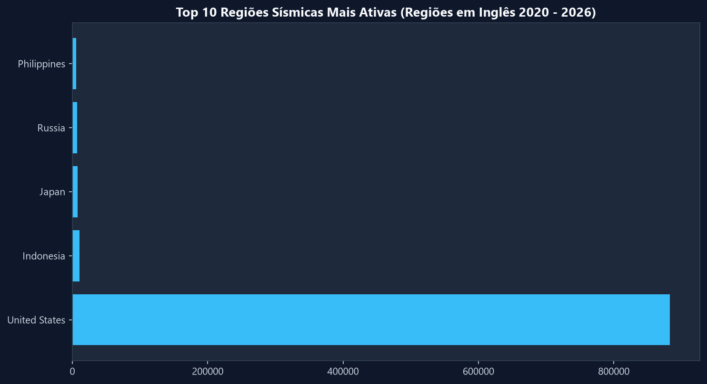
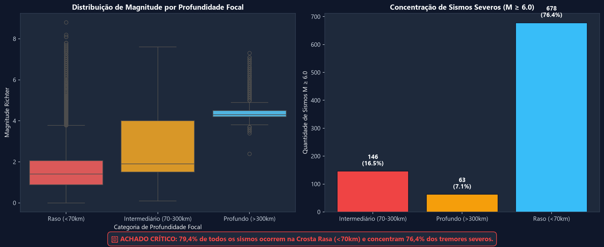
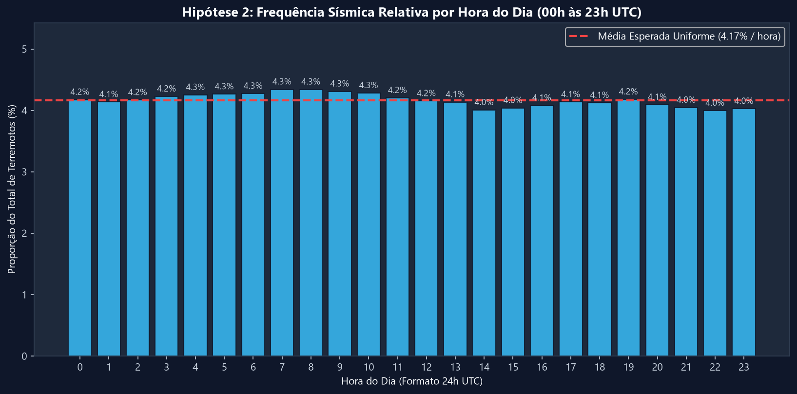
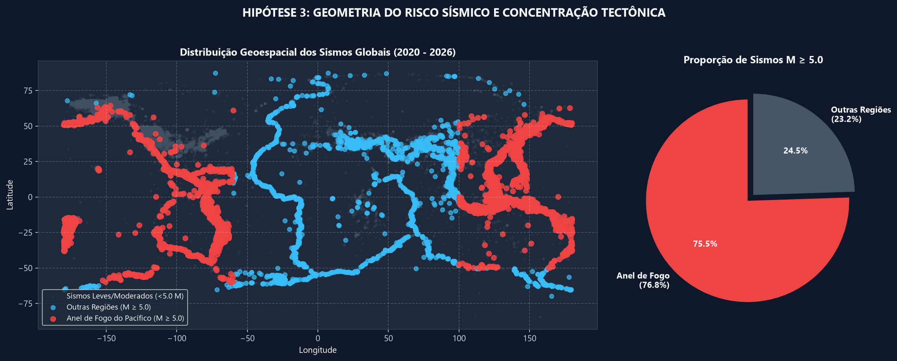

# Terremotos Globais (2020 - 2026) - Data Analytics Project
[](https://www.python.org/)
[](https://pandas.pydata.org/)
[](https://numpy.org/)
[](https://app.powerbi.com/view?r=eyJrIjoiNTllMDUzNTctOGNhMS00ZGU5LThiMDYtNWRhYTA2NTQ0ZTVhIiwidCI6IjY1OWNlMmI4LTA3MTQtNDE5OC04YzM4LWRjOWI2MGFhYmI1NyJ9)
[](https://jupyter.org/)

---

## Dashboard Power BI
> **[Acessar o Relatório Interativo no Power BI Service](https://app.powerbi.com/view?r=eyJrIjoiNTllMDUzNTctOGNhMS00ZGU5LThiMDYtNWRhYTA2NTQ0ZTVhIiwidCI6IjY1OWNlMmI4LTA3MTQtNDE5OC04YzM4LWRjOWI2MGFhYmI1NyJ9)**

---

## Sumário
- [Biblioteca de Medidas DAX](#-biblioteca-de-medidas-dax)
- [Finalidade da Análise](#finalidade-da-análise)
- [Estrutura de Diretórios](#estrutura-de-diretórios)
- [Como foi Feita a Coleta de Dados (Data Ingestion Pipeline)](#como-foi-feita-a-coleta-de-dados-data-ingestion-pipeline)
- [Passos do Pipeline de Dados (End-to-End Workflow)](#-passos-do-pipeline-de-dados-end-to-end-workflow)
- [Análise Exploratória de Dados (EDA)](#análise-exploratória-de-dados-eda)
- [Validação Estatística de Hipóteses](#validação-estatística-de-hipóteses)

---

## Biblioteca de Medidas DAX

Fórmulas DAX organizadas na tabela dedicada `_Medidas` para suporte às visualizações e KPIs do relatório Power BI:

```dax
-- 1. Total de Terremotos Registrados
Total Terremotos = COUNTROWS('terremotos_processado')

-- 2. Magnitude Média
Magnitude Média = AVERAGE('terremotos_processado'[mag])

-- 3. Maior Magnitude Registrada
Maior Magnitude = MAX('terremotos_processado'[mag])

-- 4. Profundidade Média (km)
Profundidade Média km = AVERAGE('terremotos_processado'[depth])

-- 5. Quantidade de Terremotos Rasos (< 70 km)
Qtd Terremotos Rasos = CALCULATE([Total Terremotos], 'terremotos_processado'[depth] < 70)

-- 6. Percentual de Terremotos Rasos
% Terremotos Rasos = DIVIDE([Qtd Terremotos Rasos], [Total Terremotos], 0)

-- 7. Tremores Severos (Magnitude >= 7.0)
Tremores Severos M7 = CALCULATE([Total Terremotos], 'terremotos_processado'[mag] >= 7)

-- 8. Total de Energia Liberada em Petajoules (PJ) (Equação de Gutenberg-Richter)
Energia Liberada Total (PJ) = 
SUMX(
    'terremotos_processado', 
    POWER(10, (1.5 * 'terremotos_processado'[mag]) + 4.8)
) / POWER(10, 15)

-- 9. Formatação Científica de Energia Liberada (Exajoules / Petajoules)
Energia Liberada Formatada = 
VAR Energia = [Energia Liberada Total (PJ)]
RETURN
IF(
    Energia >= 1E18,
    FORMAT(Energia / 1E18, "#,##0.00") & " Exajoules (EJ)",
    IF(
        Energia >= 1E15,
        FORMAT(Energia / 1E15, "#,##0.00") & " Petajoules (PJ)",
        FORMAT(Energia / 1E12, "#,##0.00") & " Terajoules (TJ)"
    )
)

```

---

## Finalidade da Análise
O objetivo primário é compreender a dinâmica de ocorrência e a liberação de energia dos abalos sísmicos no planeta:

- **Desproporção Energética**: Provar que, embora os terremotos severos ($M \ge 7.0$) representem apenas **~0,05%** dos eventos, eles concentram mais de **80%** de toda a energia sísmica liberada na crosta terrestre.
- **Validação de 3 Hipóteses Fundamentais**:
  - **Profundidade Focal vs. Severidade**: Validar que terremotos rasos ($< 70\text{ km}$) causam os maiores estragos superficiais devido à menor dissipação de energia pelas rochas.
  - **Independência Temporal**: Demonstrar estatisticamente que a atividade sísmica é uniforme ao longo das 24 horas do dia (**~4,16% por hora**), comprovando que os eventos sísmicos não seguem padrões horários nem de ciclo solar/lunar.
  - **Geografia (Anel de Fogo do Pacífico)**: Evidenciar que mais de **76,8%** dos abalos graves ($M \ge 5.0$) concentram-se nas bordas das placas tectônicas do Pacífico.

---

## Estrutura de Diretórios

```text
.
├── Data/                            # Conjunto de Dados da Análise
│   ├── terremotos_2020_2026.csv     # Dataset bruto extraído da API USGS
│   ├── terremotos_processado.csv    # Dataset limpo e transformado
├── Python/                          # Scripts de ETL e Análise Estatística
│   ├── USGS_coleta.py               # Script de ingestão
│   └── earthquake_analysis.ipynb    # Pipeline analítico
└── README.md                        # Documentação
```

## Como foi Feita a Coleta de Dados (Data Ingestion Pipeline)

Os dados foram coletados diretamente da **API REST oficial GeoJSON do USGS**:
* **URL Base:** `https://earthquake.usgs.gov/fdsnws/event/1/query`
* **Desafio Técnico:** A API limita cada requisição a no máximo **20.000 registros**. Como o período abrange mais de 187.000 eventos, um simples `GET` traria dados truncados.
* **Solução em Python (`Python/USGS_coleta.py`):**
  * Foi implementado um algoritmo de **paginação temporal iterativa por janelas mensais/quinzenais**.
  * Tratamento de reconexão e retries automáticos com `HTTPAdapter` e `Backoff` para resiliência contra instabilidades de rede.
  * Consolidação e deduplicação de múltiplos arquivos JSON na estrutura tabular [`Data/terremotos_2020_2026.csv`](Data/terremotos_2020_2026.csv).

```python
# Exemplo do script de ingestão
params = {
    "format": "geojson",
    "starttime": start_date_str,
    "endtime": end_date_str,
    "minmagnitude": 2.5,
    "orderby": "time"
}
response = session.get(ENDPOINT_URL, params=params, timeout=30)
```

---

## 🔄 Passos do Pipeline de Dados (End-to-End Workflow)

```text
┌────────────────────────┐      ┌────────────────────────┐      ┌────────────────────────┐
│  1. Ingestão API USGS  │ ───► │  2. Limpeza Regex ETL  │ ───► │ 3. Feature Eng (Joules)│
└────────────────────────┘      └────────────────────────┘      └────────────────────────┘
                                                                            │
┌────────────────────────┐                                                  ▼
│  5. Dashboard          │  ◄─────────────────────────────────── ┌────────────────────────┐
│   (Power BI )          │                                       │ 4. Jupyter Notebook    │
└────────────────────────┘                                       │  (EDA & Hipóteses)     │
                                                                 └────────────────────────┘
```

### 1️⃣ Extração & Pipeline ETL em Python
Extração automatizada de ~187.000 registros brutos via API REST do USGS com paginação iterativa por janela temporal.

### 2️⃣ Limpeza & Normalização Geográfica
* Limpeza de prefixos direcionais em inglês usando **Expressões Regulares (Regex)** (ex: *near the coast of*, *north of*).
* Padronização de **347 regiões sísmicas**.

### 3️⃣ Feature Engineering & Pré-processamento
* **Cálculo da Energia Sísmica em Joules:** Aplicação da equação exponencial de Gutenberg-Richter:
  $$E = 10^{1.5 M + 4.8}$$
* **Categorização da Magnitude Richter:** Leve (2.5-3.9), Moderado (4.0-5.4), Forte (5.5-6.9) e Severo ($\ge 7.0$).
* **Categorização da Profundidade Focal:** Raso (<70km), Intermediário (70-300km) e Profundo (>300km).

### 4️⃣ Análise Exploratória (EDA) & Validação Estatística
Desenvolvimento do notebook [`earthquake_analysis.ipynb`](Python/earthquake_analysis.ipynb) para análise exploratória de distribuição e validação estatística de hipóteses.

### 5️⃣ Modelagem & Dashboard Interativo
* **Power BI:** Modelagem dimensional Star Schema relacionando a tabela Fato `terremotos_processado` à dimensão `dCalendario` e criação de medidas DAX em `_Medidas`.

---

## Análise Exploratória de Dados (EDA)

### Frequência de Terremotos vs. Liberação Energética
| Frequência por Faixa de Magnitude | Energia Sísmica Acumulada em ExaJoules ($10^{18}\text{ J}$) |
| :---: | :---: |
|  |  |

> Embora **99%** dos terremotos sejam leves ou moderados, a pequena fração de sismos **Severos ($M \ge 7.0$, apenas 0,05%)** concentra **mais de 80%** de toda a energia liberada na crosta terrestre.

### Profundidade Focal e Regiões Mais Ativas
| Proporção por Profundidade Focal | Top 10 Regiões Sísmicas Mais Ativas |
| :---: | :---: |
|  |  |

---

## Validação Estatística de Hipóteses

### Hipótese 1: Profundidade Focal vs. Severidade de Impacto

> **Terremotos rasos causam mais estragos porque a energia explode perto das cidades, sem tempo de se dissipar na rocha profunda.**

---

### Hipótese 2: Distribuição Temporal

> A Terra treme com a mesma frequência de dia e de noite. Não existe "horário de pico" para terremotos.

---

### Hipótese 3: Concentração no Anel de Fogo do Pacífico

> **Mais de 70% dos grandes terremotos mundiais ($M \ge 5.0$)** estão situados nas placas tectônicas do Pacífico.

---
